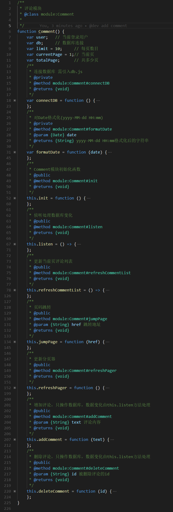

# 评论模块记录
## 步骤
1. html结构，css样式
2. 评论类变量、方法定义
3. 评论html中事件绑定
4. 评论列表实现
5. 分页器实现
6. 删除评论
7. 增加评论
## comment类 私有/公开 变量/方法

## 选择器优化

- 层级原生选择器  
```javascript
var totalComment = document.getElementsByClassName("m-header")[0].getElementsByClassName("total_comment")[0];
var userAvatar = document.getElementsByClassName("m-reply")[0].getElementsByClassName("w-avatar")[0].getElementsByTagName("img")[0];
```
- querySelector  
```javascript
var totalComment = document.querySelector(".m-header .total_comment");
var userAvatar = document.querySelector(".m-reply .w-avatar img");
```

## 列表dom操作优化

- 循环插入  
- documentFragment

## 何时刷新分页器和评论
### 刷新分页器
1. 初始化
2. 点击页码/上一页/下一页
3. 增加/删除评论导致总页码发生变化  
### 刷新评论
1. 初始化
2. 增加/删除评论
3. 页码变化
### 策略
- 刷新分页器结束后刷新评论
- 页码变化总是刷新分页器
- 增加/删除评论 总是刷新分页器 or 预先查数据库上一次总页面数目，与当前总数目不相同时刷新  
缺点：多操作dom or 多查询一次数据库

## 分页器绑定点击事件

- 绑定在可见页码以及上一页和下一页的按钮上   
重复绑定多次相同事件
- 绑定在分页器父级组件  
判断不可点击子组件并处理
```javascript
// 省略号不进行跳页
e.target.href && comment.jumpPage(e.target.href);
```
```javascript
if (/#\/page\/next/.test(href)) {
    // 页码为最后一页，不跳页
    currentPage <= totalPage && (currentPage += 1);
} else if (/#\/page\/previous/.test(href)) {
    // 页码为第一页，不跳页
    currentPage > 1 && (currentPage -= 1);
} else {
    currentPage = /#\/page\/(\d+)/.exec(href)[1] - 0; // page转成number
}
```