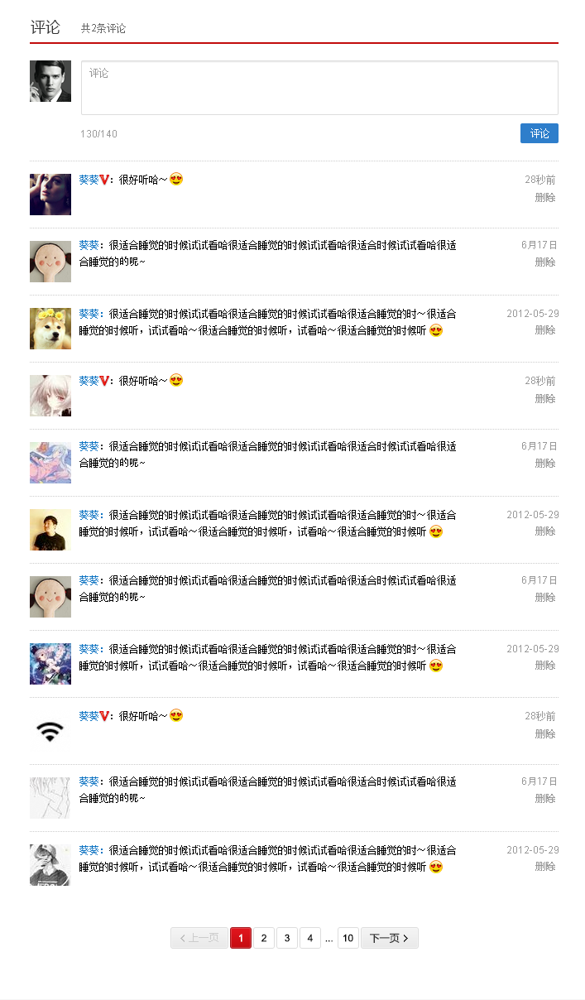
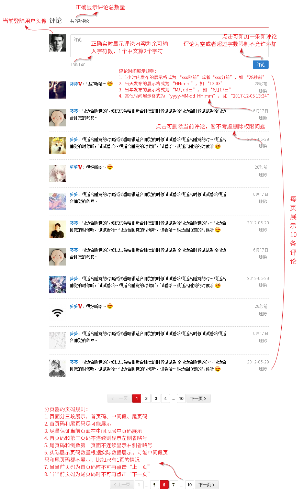

# 完成评论模块效果图的功能部分

本作业为计分作业，纳入整个微专业考核分数统计之中，请同学认真谨慎完成作业代码的编写，在作业截止时间内上传源码文件，提交审核。


## 作业说明

请完成以下评论模块效果图的功能需求，作业要求如下

1. HTML结构和CSS代码可以使用你自己在《CSS》课程的作业输出结果，也可以使用本作业提供给你的参考代码
2. 评论的 CRUD（增删查改） 操作接口统一使用素材中的 db.js 文件提供的接口，接口说明见下文
3. 实现评论发布功能，当有新评论发布时评论列表需增加发布的评论项、评论数、评论页码数需要同步更新
4. 实现评论删除功能，当评论被删除时评论数、评论页码数需要同步更新，如果因为当前页最后一条评论被删除则需要将当前页码重置为上一页
5. 实现评论分页功能，评论页码在初始化、评论数量发生变化时能够正确展示
6. 代码提交时包含HTML结构、CSS代码、JavaScript代码

作业效果图如下



功能交互说明如下



参考HTML结构

```html
<!DOCTYPE html>
<html>

<head>
    <meta charset="UTF-8">
    <title>评论</title>
</head>

<body>
    <section class="g-main">
        <header class="m-header f-clear">
            <h2>评论</h2>
            <span class="count">共2条评论</span>
        </header>
        <div class="m-reply f-clear">
            <a class="w-avatar" href="#">
                
            </a>
            <form class="reply" method="post" action="/comment">
                <div class="txt">
                    <textarea placeholder="评论"></textarea>
                </div>
                <div class="submit f-clear">
                    <span class="count"><span>130</span>/140</span>
                    <button type="submit">评论</button>
                </div>
            </form>
        </div>
        <ul class="m-comments">
            <li class="m-comment f-clear">
                <a class="w-avatar" href="#">
                    
                </a>
                <div class="reply">
                    <p><time>28秒前</time></p>
                    <p><a href="#">删除</a></p>
                </div>
                <div class="comment">
                    <p><a class="user" href="#">葵葵</a>：很好听哈～</p>
                </div>
            </li>
            <li class="m-comment f-clear">
                <a class="w-avatar" href="#">
                    
                </a>
                <div class="reply">
                    <p><time>10分前</time></p>
                    <p><a href="#">删除</a></p>
                </div>
                <div class="comment">
                    <p><a class="user" href="#">葵葵</a>：很好听哈～</p>
                </div>
            </li>
            <li class="m-comment f-clear">
                <a class="w-avatar" href="#">
                    
                </a>
                <div class="reply">
                    <p><time>6月17日</time></p>
                    <p><a href="#">删除</a></p>
                </div>
                <div class="comment">
                    <p><a class="user" href="#">葵葵</a>：很好听哈～很好听哈～很好听哈～很好听哈～很好听哈～很好听哈～很好听哈～很好听哈～很好听哈～很好听哈～很好听哈～很好听哈～很好听哈～很好听哈～很好听哈～很好听哈～很好听哈～很好听哈～很好听哈～很好听哈～很好听哈～很好听哈～很好听哈～很好听哈～很好听哈～很好听哈～很好听哈～很好听哈～很好听哈～很好听哈～很好听哈～</p>
                </div>
            </li>
            <li class="m-comment f-clear">
                <a class="w-avatar" href="#">
                    
                </a>
                <div class="reply">
                    <p><time>2018-02-24 13:20</time></p>
                    <p><a href="#">删除</a></p>
                </div>
                <div class="comment">
                    <p><a class="user" href="#">葵葵</a>：很好听哈～很好听哈～很好听哈～很好听哈～很好听哈～很好听哈～很好听哈～很好听哈～很好听哈～很好听哈～很好听哈～很好听哈～很好听哈～很好听哈～很好听哈～很好听哈～很好听哈～很好听哈～</p>
                </div>
            </li>
            <li class="m-comment f-clear">
                <a class="w-avatar" href="#">
                    
                </a>
                <div class="reply">
                    <p><time>2018-02-24 13:20</time></p>
                    <p><a href="#">删除</a></p>
                </div>
                <div class="comment">
                    <p><a class="user" href="#">葵葵</a>：～很好听哈～很好听哈～很好听哈～很好听哈～</p>
                </div>
            </li>
            <li class="m-comment f-clear">
                <a class="w-avatar" href="#">
                    
                </a>
                <div class="reply">
                    <p><time>2018-02-24 13:20</time></p>
                    <p><a href="#">删除</a></p>
                </div>
                <div class="comment">
                    <p><a class="user" href="#">葵葵</a>：～很好听哈～很好听哈～很好听哈～很好听哈～</p>
                </div>
            </li>
            <li class="m-comment f-clear">
                <a class="w-avatar" href="#">
                    
                </a>
                <div class="reply">
                    <p><time>2018-02-24 13:20</time></p>
                    <p><a href="#">删除</a></p>
                </div>
                <div class="comment">
                    <p><a class="user" href="#">葵葵</a>：～很好听哈～很好听哈～很好听哈～很好听哈～</p>
                </div>
            </li>
            <li class="m-comment f-clear">
                <a class="w-avatar" href="#">
                    
                </a>
                <div class="reply">
                    <p><time>2018-02-24 13:20</time></p>
                    <p><a href="#">删除</a></p>
                </div>
                <div class="comment">
                    <p><a class="user" href="#">葵葵</a>：～很好听哈～很好听哈～很好听哈～很好听哈～</p>
                </div>
            </li>
            <li class="m-comment f-clear">
                <a class="w-avatar" href="#">
                    
                </a>
                <div class="reply">
                    <p><time>2018-02-24 13:20</time></p>
                    <p><a href="#">删除</a></p>
                </div>
                <div class="comment">
                    <p><a class="user" href="#">葵葵</a>：～很好听哈～很好听哈～很好听哈～很好听哈～</p>
                </div>
            </li>
            <li class="m-comment f-clear">
                <a class="w-avatar" href="#">
                    
                </a>
                <div class="reply">
                    <p><time>2018-02-24 13:20</time></p>
                    <p><a href="#">删除</a></p>
                </div>
                <div class="comment">
                    <p><a class="user" href="#">葵葵</a>：～很好听哈～很好听哈～很好听哈～很好听哈～</p>
                </div>
            </li>
        </ul>
        <ul class="m-pager">
            <li class="btn prv j-disabled"><a href="/page/8">&lt;上一页</a></li>
            <li class="itm"><a href="/page/1">1</a></li>
            <li class="sep"><span>...</span></li>
            <li class="itm"><a href="/page/2">8</a></li>
            <li class="itm j-selected"><a href="/page/3">9</a></li>
            <li class="itm"><a href="/page/4">10</a></li>
            <li class="sep"><span>...</span></li>
            <li class="itm"><a href="/page/10">100</a></li>
            <li class="btn nxt"><a href="/page/10">下一页&gt;</a></li>
        </ul>
    </section>
</body>
</html>
```

参考CSS代码

```css
/* reset */
* {
    margin: 0;
    padding: 0;
    font-weight: normal;
    font-style: normal;
    font-size: 12px;
}

ul, li {
    list-style: none;
}

a {
    text-decoration: none;
}

/* common function */
.f-clear{
    clear: both;
}

.f-clear:after {
    content: '';
    clear: both;
    display: block;
    height: 0;
    visibility: hidden;
}

.g-main {
    padding: 0 20px;
}

/* header*/
.m-header {
    height: 33px;
    border-bottom: 2px solid #c20c0c;
}

.m-header h2 {
    float: left;
    font-size: 20px;
    line-height: 28px;
}

.m-header .count {
    float: left;
    margin: 9px 0 0 20px;
    color: #666;
}

/* reply */
.m-reply {
    margin-top: 20px;
    clear: both;
}

.m-reply .txt {
    padding-right: 14px;
}

.w-avatar {
    float: left;
    width: 50px;
    height: 50px;
}

.m-reply .reply {
    margin-left: 55px;
}

.m-reply .reply textarea {
    width: 100%;
    height: 50px;
    display: block;
    padding: 5px 6px 6px;
    border: 1px solid #cdcdcd;
    border-radius: 2px;
    line-height: 19px;
    resize: none;
}

.m-reply .submit {
    margin-top: 10px;
}

.m-reply .submit .count {
    float: left;
    margin-right: 10px;
    line-height: 25px;
    color: #999;
}

.m-reply .submit [type="submit"] {
    float: right;
    width: 46px;
    height: 25px;
    color: #fff;
    text-align: center;
    line-height: 25px;
    background: #2E7ECB;
    border: 1px solid #2377C8;
    border-radius: 2px;
}

/* comment list */
.m-comments {
    margin-top: 20px;
}

.m-comment {
    padding: 15px 0;
    border-top: 1px dotted #ccc;
}

.m-comment .reply {
    float:right;
    width: 110px;
    text-align: right;
}

.m-comment .reply, .m-comment .reply a{
    color: #999;
}

.m-comment .comment {
    margin: 0 110px 0 55px;
}

.m-comment .comment .user {
    color: #0c73c2;
}

/* comment pager */
.m-pager {
    margin: 20px 0;
    text-align:center;
}

.m-pager>li {
    display: inline-block;
}

.m-pager a{
    min-width: 12px;
    display: block;
    color: #333;
    padding: 5px 8px;
    border: 1px solid #ddd;
    border-radius: 2px;
}

.m-pager .btn a{
    background: #f0f0f0;
}

.m-pager .j-disabled a{
    color: #ccc;
    background: #f1f1f1;
    cursor: not-allowed;
}

.m-pager .j-selected a{
    color: #fff;
    background: #d41017;
    border-color: #a3171c;
}
```

## 评论 CRUD 接口说明

评论 CRUD 接口使用可参考 作业素材/db/db.example.html 中的范例

db.js 文件会使用 ES6 的 Promise 特性，低版本支持 Promise 特性可引入此 [Promise polyfill](https://github.com/stefanpenner/es6-promise)

### 页面引入 db.js

实现时通过引入 作业素材/db/db.js 文件来完成评论的增删查改操作，页面引入方式举例如

```html
<!DOCTYPE html>
<html>
<head>
    <meta charset="UTF-8">
    <title>Comment DB Example</title>
</head>
<body>
    <script src="/path/to/db.js"></script>
</body>
</html>
```

### DBComment

在使用评论 CRUD 接口之前需要先实例化 DBComment，然后在实例上调用相应接口，对于评论相关的 CRUD 接口均返回一个对应的 Promise 对象

```javascript
var db = new DBComment();
```

### 获取当前登陆用户

通过 DBComment 实例的 getLoginUser 接口可获取当前登陆用户信息，使用范例如下

```javascript
// user.id           - 用户标识
// user.nickName     - 用户昵称
// user.avatarURL    - 用户头像地址
var user = db.getLoginUser();
```

### 获取评论总数

通过 DBComment 实例的 getCommentTotal 接口可获取评论总数，使用范例如下

```javascript
db.getCommentTotal().then(function(ret){
     // ret - 数值，评论总数
     // TODO something
});
```

### 获取评论列表

通过 DBComment 实例的 getCommentList 接口可获取评论列表，使用范例如下

```javascript
var opt = {
    // 当前页码
    page: 2,
    // 每页显示数量
    limit: 10
};
db.getCommentList(opt).then(function(ret){
    // ret - 数组，当前页评论列表
    // TODO something
});
```

### 添加评论

通过 DBComment 实例的 addComment 接口可添加评论项，使用范例如下

```javascript
var data = {
    // 评论内容
    content: 'comment content'
};
db.addComment(data).then(function(ret){
    // ret - 对象，添加的评论项数据
    // TODO something
});
```

### 删除评论

通过 DBComment 实例的 removeComment 接口可删除评论项，使用范例如下

```javascript
// 评论 ID
var id = '454545';
db.removeComment(id).then(function(ret){
    // ret - 对象，删除的评论项数据
    // TODO something
});
```

### 列表变化事件

当执行评论添加和删除操作时 DBComment 实例上回触发一个 listchange 事件，该事件可以通过 on 接口添加回调监听列表的变化情况，使用范例如下

```javascript
db.on('listchange', function(event){
    // event.data - 事件数据
    // event.type - 事件类型
    // event.action - 引起列表变化的操作类型
    // TODO something
});
```

## 评分标准（10分）

1. 实现评论发布功能
    * 评论列表加一条记录（1）
    * 评论页码同步（1）
    * 评论数同步（1）
    * 评论输入剩余字数显示正确（1）
2. 实现评论删除功能
    * 评论列表删除一条记录（1）
    * 评论页码同步（1）
    * 评论数同步（1）
3. 实现翻页功能
    * 正确展示页码列表及当前页码效果（2）
    * 上一页按钮在首页时禁用、下一页按钮在尾页时禁用（1）

## 参考答案

